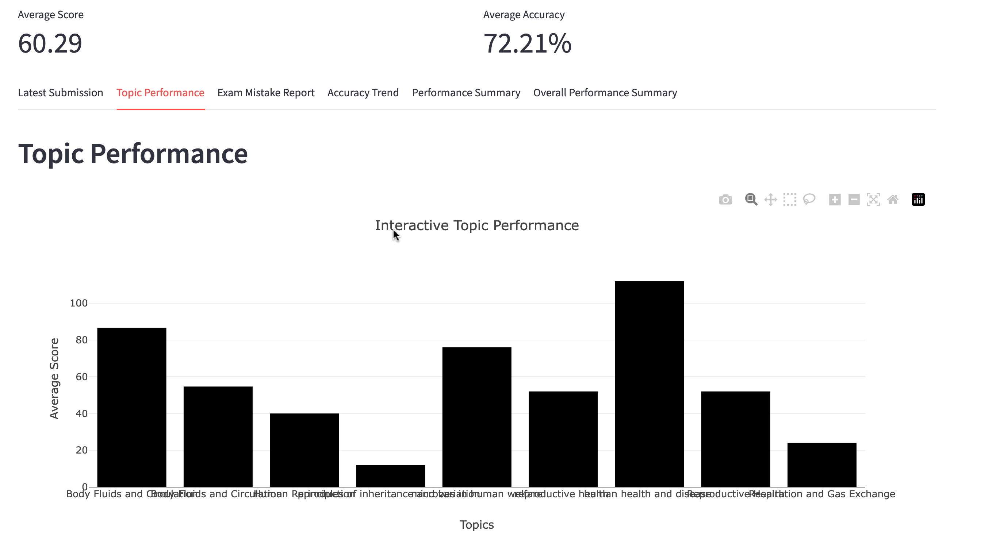
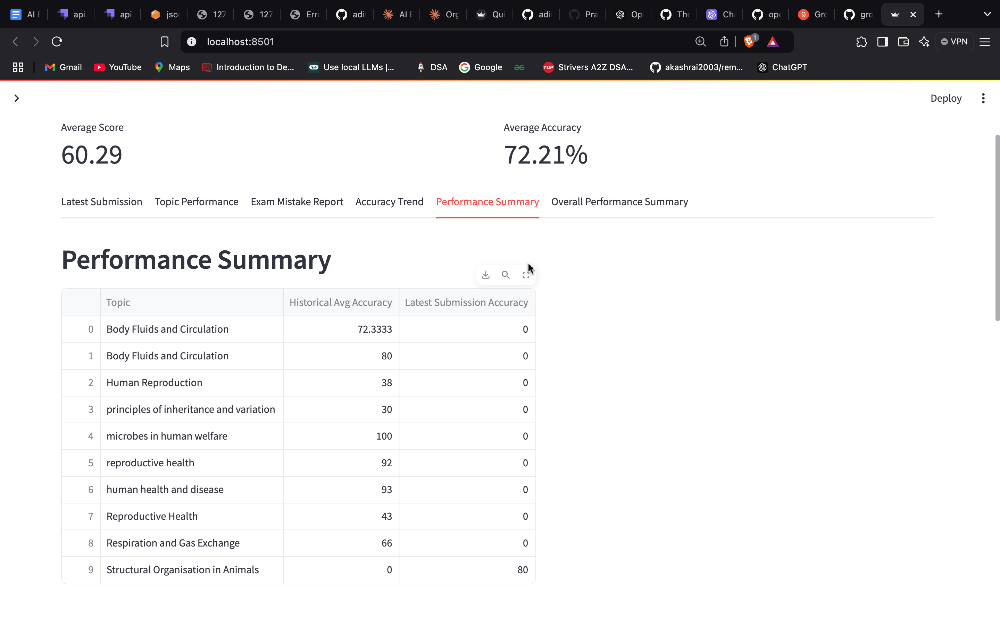
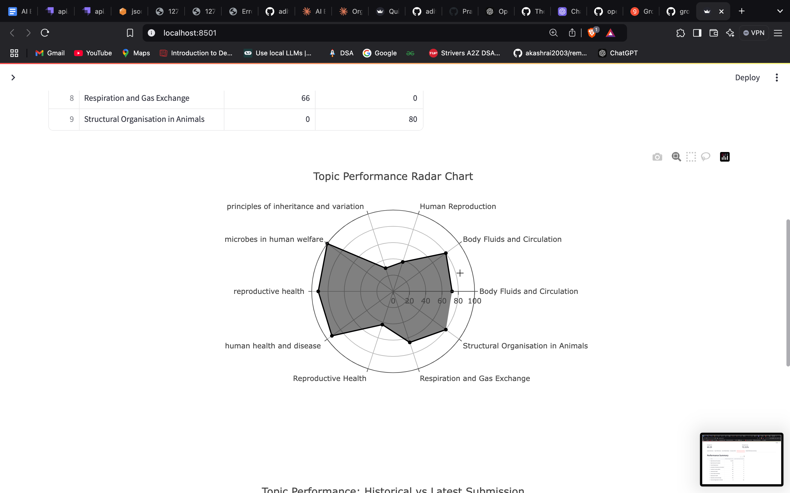
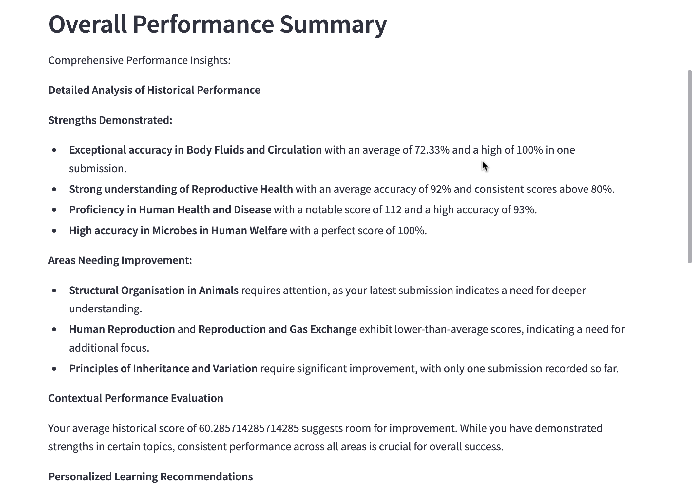

# Quiz Performance Dashboard

## Overview
An interactive Streamlit dashboard for visualizing and analyzing quiz performance using Python, Plotly, and Gemini AI.

## Features
- Interactive visualizations of quiz performance
- Topic-wise performance analysis
- Accuracy trend tracking
- AI-powered insights generation

## Prerequisites
- Python 3.8+
- Streamlit
- Plotly
- Google Generative AI
- Requests

## Installation
```bash
pip install -r requirements.txt
```

## Setup
1. Clone the repository
2. Install dependencies
3. Set up Gemini API key
4. Run the application

## Running the Dashboard
```bash
streamlit run dashboard.py
```

## Screenshots








## Key Technologies
- Streamlit
- Plotly
- Gemini AI
- Python

## License
MIT License
